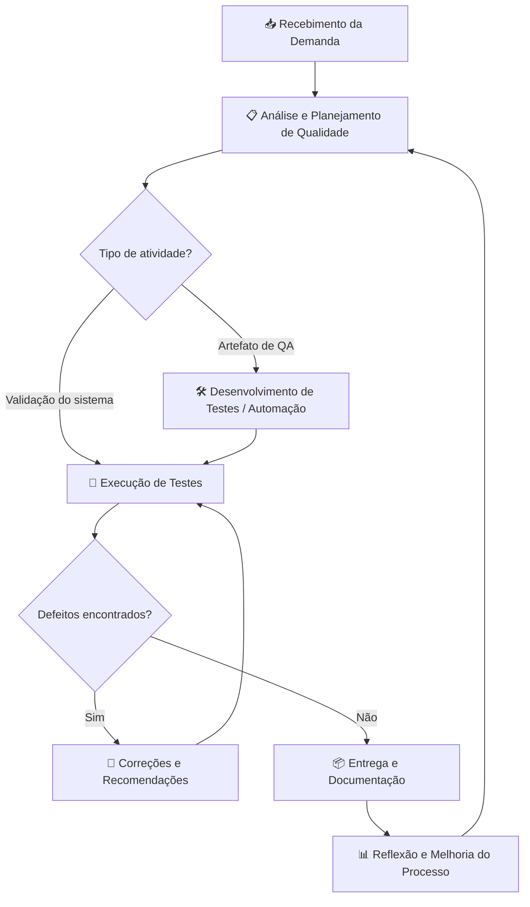
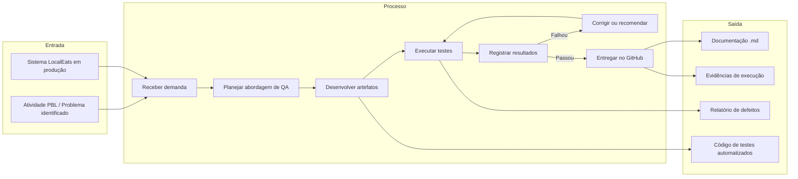

# 🧩 Atividade PBL – Aula 14
## Qualidade de Processo – LocalEats

> Disciplina: Qualidade de Software  
> Prof.: Luciano Zanuz  
> Integrante: Filipe Tenedini Domingos  
> Sistema: [LocalEats](https://local-eats-unisenac.vercel.app/)

---

## 👥 Integrantes

- Filipe Tenedini Domingos

---

## 🔹 1. Mapeamento do Processo Atual

### Contexto

O mapeamento abaixo representa o **processo utilizado pela equipe de Qualidade de Software** para analisar, testar e validar o sistema LocalEats ao longo da disciplina. Esse fluxo evoluiu progressivamente — de testes manuais ad hoc (situação diagnosticada na Aula 3) até automação com TDD, Playwright e BDD (Aulas 9, 10 e 12).

O diagrama contempla as etapas mínimas exigidas: recebimento da demanda, desenvolvimento, testes, correções e entrega.

### Fluxo da Equipe — Visão Geral



### Fluxo Detalhado (BPMN simplificado)



### Descrição das etapas

| # | Etapa | O que acontece na prática |
|---|---|---|
| 1 | **Recebimento da demanda** | A equipe recebe a atividade PBL (ex.: planejar testes, automatizar login, escrever cenários BDD) ou identifica problemas no LocalEats (ex.: busca textual quebrada — CT-05, Aula 6) |
| 2 | **Análise e planejamento** | Define escopo, funcionalidades, tipos de teste e prioridades com base no diagnóstico de QA (Aula 3) e na estratégia de testes (Aula 4) |
| 3 | **Desenvolvimento** | Implementa casos de teste manuais, scripts Playwright, testes unitários com TDD ou cenários Gherkin — conforme a atividade |
| 4 | **Execução de testes** | Roda testes manuais em produção, `pytest` para unitários/E2E/BDD, registra pass/fail e evidências |
| 5 | **Correções** | Quando possível, corrige automações ou código de teste; quando o defeito é do sistema, documenta recomendação (ex.: corrigir busca textual) |
| 6 | **Entrega** | Publica documentação Markdown e código no repositório GitHub do grupo |

### Evolução do processo ao longo da disciplina

```text
Aula 3  → Diagnóstico (processo informal identificado no LocalEats)
Aula 4  → Estratégia de testes (pirâmide, prioridades)
Aula 5  → Testes caixa-preta vs caixa-branca
Aula 6  → Plano + execução manual (9 casos de teste, 44% falha)
Aula 9  → TDD + testes unitários (regras de negócio)
Aula 10 → Automação E2E com Playwright + POM (login)
Aula 12 → BDD com Gherkin + pytest-bdd (filtro por categoria)
Aula 14 → Mapeamento e reflexão sobre o processo (esta atividade)
```

---

## 🔹 2. Identificação de Entradas, Atividades e Saídas

| Etapa | Entrada | Atividade | Saída |
|---|---|---|---|
| **Recebimento da demanda** | Atividade PBL, enunciado da aula, problemas conhecidos do LocalEats (Aula 3 e PBL-1) | Analisar o objetivo, identificar funcionalidades afetadas e definir escopo de trabalho | Demanda compreendida e escopo delimitado |
| **Análise e planejamento de qualidade** | Diagnóstico de QA, funcionalidades críticas (pedidos, busca, login), pirâmide de testes | Elaborar estratégia, plano de testes, casos de teste e critérios de aceitação | Plano de testes documentado (Aulas 4 e 6) |
| **Desenvolvimento de artefatos de qualidade** | Requisitos de comportamento, regras de negócio, fluxos da interface | Implementar casos manuais, testes unitários (TDD), scripts Playwright, cenários Gherkin e Page Objects | Código de testes (`aula-09/`, `aula-10/`, `aula-12/`) e casos de teste (CT-01 a CT-09) |
| **Execução de testes** | Artefatos desenvolvidos, ambiente de produção (`local-eats-unisenac.vercel.app`), credenciais de teste | Executar testes manuais e automatizados (`pytest`), registrar resultados e evidências (logs, prints) | Relatório de execução com total pass/fail e evidências |
| **Análise de resultados e correções** | Evidências de testes, defeitos registrados (ex.: CT-05 busca, CT-09 IDs no histórico) | Classificar severidade, documentar bugs, ajustar automações ou emitir recomendações ao desenvolvimento | Lista de defeitos priorizados e automações corrigidas |
| **Entrega e documentação** | Versão validada dos artefatos, reflexões da equipe | Consolidar entregáveis em Markdown, organizar repositório, registrar aprendizados | Arquivos `.md` no GitHub, código versionado, reflexão crítica |
| **Melhoria contínua do processo** | Lições aprendidas de cada aula, taxa de falha (44% na Aula 6), gaps identificados | Revisar o processo, propor padronização, automação e integração CI/CD | Propostas de melhoria documentadas (Aulas 3, 6 e 14) |

---

## 🔹 3. Reflexão sobre o Processo

### 1. O processo utilizado pela equipe está claramente definido?

**Parcialmente.** Ao longo da disciplina, a equipe foi **construindo** um processo de qualidade de forma incremental — cada aula adicionou uma camada (estratégia → plano → manual → unitário → E2E → BDD). Porém, no início (Aula 3), o diagnóstico revelou que o **processo real do LocalEats** não está formalizado: *"não existe um profissional ou processo dedicado à qualidade [...] a qualidade depende exclusivamente da atenção individual de cada desenvolvedor"*.

A equipe de QA da disciplina tem processo mais claro do que a startup analisada — mas ainda falta documentação formal única (playbook) que una todas as etapas.

### 2. Todos os integrantes seguem o mesmo fluxo de trabalho?

**Na disciplina, sim** — as entregas seguem padrão consistente: documento Markdown + código (quando aplicável) + evidências + reflexão. **No LocalEats em produção, não** — a Aula 3 identificou responsabilidades diluídas, sem QA formal e sem critérios de aceitação padronizados. Isso explica inconsistências como mensagem de erro em inglês (CT-02) e histórico com IDs internos (CT-09): diferentes partes do sistema foram validadas de formas distintas.

### 3. Em quais etapas a qualidade é verificada?

| Etapa | Verificação de qualidade |
|---|---|
| Planejamento | Definição de escopo, prioridades e tipos de teste (Aulas 4 e 6) |
| Desenvolvimento | TDD garante regras de negócio antes da integração (Aula 9) |
| Testes manuais | Validação funcional e usabilidade em produção (Aula 6 — 9 CTs) |
| Testes automatizados | Regressão de login (Aula 10) e filtro por categoria (Aula 12) |
| Análise de resultados | Classificação de defeitos e taxa de falha (44% na Aula 6) |
| Entrega | Revisão dos entregáveis e reflexão crítica (todas as aulas) |

**Lacuna identificada:** no processo original do LocalEats, a qualidade é verificada apenas de forma pontual antes do deploy — sem automação de regressão, sem BDD documentando comportamento e sem pipeline CI/CD.

### 4. Quais melhorias poderiam tornar o processo mais eficiente?

1. **Definition of Done (DoD)** — checklist obrigatório: código revisado, testes unitários passando, casos manuais críticos executados, documentação atualizada (proposto na Aula 3).
2. **Pipeline CI/CD** — executar `pytest` (unitário + E2E + BDD) automaticamente a cada push, impedindo regressões como a busca textual quebrada (CT-05).
3. **Papel formal de QA** — orquestrar o processo, manter plano de testes vivo e registrar defeitos de forma rastreável (Aula 3).
4. **Critérios de aceitação em Gherkin** — transformar requisitos em cenários BDD antes do desenvolvimento, reduzindo ambiguidade (Aula 12).
5. **Ambiente de homologação** — deixar de testar diretamente em produção (como na Aula 6), reduzindo risco e permitindo testes destrutivos.
6. **Retrospectivas periódicas** — revisar taxa de falha, atualizar automações e ajustar o processo (como esta Aula 14 propõe).

### 5. Como a qualidade do processo impacta a qualidade do produto final?

A relação é **direta e comprovada** no caso do LocalEats:

| Processo deficiente | Impacto no produto (evidência) |
|---|---|
| Sem testes antes do deploy | 44% dos testes manuais falharam (Aula 6) |
| Sem critérios de aceitação | Busca textual retorna vazio (CT-05); histórico exibe IDs (CT-09) |
| Sem automação de regressão | Bugs conhecidos persistem entre versões |
| Qualidade diluída entre devs | Pedidos duplicados, avaliações que desaparecem (Aula 3) |
| Processo de QA estruturado (disciplina) | Testes unitários, E2E e BDD passando; defeitos documentados e priorizados |

> **Conclusão:** um processo organizado, com etapas claras de planejamento, desenvolvimento orientado a testes e validação sistemática, **reduz defeitos, retrabalho e custo de correção**. O LocalEats demonstra o oposto: processo informal gera produto com falhas em funcionalidades críticas (busca, pedidos, confiabilidade). A evolução do processo da equipe — de diagnóstico ad hoc para pirâmide de testes + TDD + automação + BDD — representa exatamente o caminho necessário para elevar a qualidade do produto.

---

## 💡 Conclusão

Esta atividade permitiu enxergar que **qualidade de software não é apenas testar o produto final** — é desenhar um processo onde qualidade é verificada em múltiplos pontos: no planejamento, no desenvolvimento (TDD), na automação (Playwright), na documentação viva (BDD) e na entrega (evidências + reflexão).

A pergunta orientadora — *"Como nossa equipe produz software e de que forma esse processo influencia a qualidade do LocalEats?"* — tem resposta clara: **quanto mais estruturado e automatizado o processo, menor a taxa de defeitos e maior a confiança no sistema entregue**. O próximo passo para o projeto do grupo é consolidar as práticas das Aulas 3–12 em um **processo único, documentado e executado continuamente** — não apenas em atividades acadêmicas isoladas.
