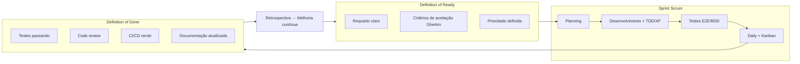

# 🧩 Atividade PBL – Aula 16
## Qualidade em Metodologias Ágeis – LocalEats

> Disciplina: Qualidade de Software  
> Prof.: Luciano Zanuz  
> Integrante: Filipe Tenedini Domingos  
> Sistema: [LocalEats](https://local-eats-unisenac.vercel.app/)

---

## 👥 Integrantes

- Filipe Tenedini Domingos

---

## 📌 Contexto

Nas Aulas 14 e 15, a equipe mapeou o processo de qualidade do LocalEats e classificou sua maturidade no **nível Gerenciado (CMMI 2 / MPS.BR E)**. Esta atividade analisa esse mesmo processo sob a ótica das metodologias ágeis — Scrum, XP, Kanban e Lean — identificando práticas já adotadas e propondo melhorias concretas, incluindo **Definition of Ready (DoR)** e **Definition of Done (DoD)** aplicáveis ao projeto.

---

## 🔹 1. Análise de Práticas Ágeis no Processo

| Prática | Existe no processo? | Como é aplicada atualmente? | Pode ser melhorada? |
|---|---|---|---|
| **Planejamento iterativo** | Parcialmente | Cada aula PBL funciona como uma iteração com objetivo, escopo e entrega definidos (ex.: Aula 6 = testes manuais; Aula 10 = automação E2E). Não há sprints formais com duração fixa | Sim — adotar ciclos Scrum de 1–2 semanas com Sprint Planning e Review |
| **Priorização de funcionalidades** | Sim | Aula 4 priorizou fluxos críticos (pedidos, busca, avaliações); Aula 6 testou 9 CTs por ordem de impacto; PBL-1 classificou problemas ISO 25010 por severidade | Sim — usar backlog priorizado com método MoSCoW ou valor de negócio, revisado a cada sprint |
| **Entregas incrementais** | Sim | Entregas parciais a cada aula: diagnóstico (A3) → estratégia (A4) → plano+execução (A6) → TDD (A9) → E2E (A10) → BDD (A12) → processo (A14–16) | Sim — incrementos deveriam incluir correções no produto LocalEats, não apenas artefatos de QA |
| **Feedback frequente** | Parcialmente | Reflexões ao final de cada aula; execução de testes gera feedback imediato (pass/fail). Porém, não há feedback loop com a equipe de desenvolvimento do LocalEats | Sim — incluir demos ao PO/stakeholders e daily standups para alinhar progresso |
| **Trabalho colaborativo** | Parcialmente | Repositório GitHub compartilhado; documentação coletiva. Equipe reduzida (1 integrante principal); sem pair programming ou code review formal (lacuna Aula 15) | Sim — pair testing, revisão cruzada de cenários BDD e rotação de responsabilidades por sprint |
| **Controle visual das atividades** | Não | Tarefas organizadas por pastas no Git (`aula-09/`, `aula-10/`, etc.), mas sem quadro Kanban, burndown ou visibilidade de status (To Do / Doing / Done) | Sim — implementar quadro Kanban (GitHub Projects ou Trello) com WIP limits |
| **Melhoria contínua** | Parcialmente | Reflexões em todas as aulas; Aula 14 mapeou processo; Aula 15 propôs evolução de maturidade. Sem retrospectiva formal periódica (Retrospective Scrum) | Sim — instituir retrospectiva ao final de cada sprint com ações concretas e acompanhamento |

### Conclusão

O processo da equipe apresenta **fundamentos ágeis parciais**: entregas incrementais por aula, priorização baseada em risco e reflexões contínuas demonstram mentalidade iterativa. Os principais **pontos fortes** são a evolução progressiva das práticas de qualidade (manual → TDD → E2E → BDD), a documentação viva no GitHub e a priorização orientada ao valor de negócio (Aula 4). As **oportunidades de melhoria** concentram-se na falta de controle visual (Kanban), colaboração formal (pair review, dailies), feedback com stakeholders do LocalEats e na distância entre o processo ágil da equipe de QA e o processo ad hoc da startup (Aula 3). Adotar DoR, DoD e práticas Scrum/XP/Kanban/Lean propostas abaixo posicionaria o processo no nível **Definido** (Aula 15), alinhando metodologia ágil com qualidade de software.

---

## 🔹 2. Propostas de Melhoria Ágil

| # | Melhoria Proposta | Metodologia Relacionada | Benefício Esperado |
|---|---|---|---|
| 1 | **Implementar quadro Kanban** com colunas *Backlog → Em Progresso → Em Teste → Concluído* para acompanhar tarefas de QA e correções do LocalEats | **Kanban** | Visibilidade do fluxo de trabalho, identificação de gargalos, limitação de WIP e acompanhamento visual do andamento |
| 2 | **Adotar TDD e testes automatizados como prática padrão** — nenhuma regra de negócio entra em produção sem teste unitário prévio (modelo Aula 9) | **XP** (Test-Driven Development) | Redução de defeitos em regras críticas (valor mínimo de pedido, descontos, taxa de entrega); feedback imediato ao desenvolvedor |
| 3 | **Instituir Sprints de 2 semanas** com Planning (priorizar backlog), Daily (15 min alinhamento), Review (demo dos testes/evidências) e Retrospective (melhorias) | **Scrum** | Ritmo previsível de entregas, alinhamento da equipe, inspeção e adaptação contínuas |
| 4 | **Aplicar Pair Testing** — dois integrantes executam casos de teste juntos, um operando e outro documentando | **XP** (Pair Programming adaptado para QA) | Maior cobertura de cenários, compartilhamento de conhecimento, redução de viés individual |
| 5 | **Eliminar desperdício (Muda)** — automatizar testes de regressão dos fluxos críticos (login, filtro, pedido) via CI/CD, evitando reexecução manual repetitiva | **Lean** (Eliminar desperdício) | Libera tempo da equipe para testes exploratórios e novos cenários; reduz retrabalho documentado na Aula 6 |
| 6 | **Escrever critérios de aceitação em Gherkin antes do desenvolvimento** — cenários BDD como contrato entre negócio, dev e QA (modelo Aula 12) | **BDD + Scrum** (Product Backlog refinement) | Reduz ambiguidade de requisitos; comportamento esperado documentado e executável desde o início |
| 7 | **Integrar pipeline CI/CD no GitHub Actions** — `pytest` (unitário + E2E + BDD) executado a cada push/PR | **XP** (Integração Contínua) + **DevOps** | Detecção precoce de regressões; impede merge de código que quebra testes existentes |

---

## 🔹 3. Definition of Ready (DoR)

Uma funcionalidade ou item de backlog estará **pronto para desenvolvimento** quando atender **todos** os critérios abaixo:

| # | Critério |
|---|---|
| 1 | O requisito possui **descrição clara** do comportamento esperado, compreensível por negócio, desenvolvimento e QA |
| 2 | Os **critérios de aceitação** estão definidos — preferencialmente em Gherkin (Given/When/Then), como na Aula 12 |
| 3 | A **prioridade** foi definida no backlog com base em impacto ao negócio (ex.: pedidos e busca = alta prioridade, conforme Aula 4) |
| 4 | As **dependências** foram identificadas e resolvidas (ex.: login funcional é pré-condição para testar favoritos ou pedidos) |
| 5 | Existe **estimativa de esforço** acordada pela equipe (story points ou horas) |
| 6 | Os **dados de teste** necessários estão disponíveis (credenciais, massa de dados, ambiente acessível) |
| 7 | O **impacto em funcionalidades existentes** foi analisado — especialmente fluxos já automatizados (Aulas 10 e 12) |

### Exemplo aplicado ao LocalEats

> **Item de backlog:** "Corrigir busca textual de restaurantes"  
> **DoR atendido quando:** critério de aceitação "Dado que o usuário digita 'Brasileira' e clica Buscar, Então a listagem exibe Restaurante Sabor 5 e Sabor 8" estiver escrito em Gherkin; prioridade = alta (CT-05 falhou na Aula 6); ambiente de produção acessível; estimativa = 3 story points.

---

## 🔹 4. Definition of Done (DoD)

Uma funcionalidade será considerada **concluída** quando atender **todos** os critérios abaixo:

| # | Critério |
|---|---|
| 1 | Os **critérios de aceitação** definidos no DoR foram **validados e aprovados** |
| 2 | **Testes unitários** cobrem as regras de negócio implementadas e estão passando (`pytest`) |
| 3 | **Testes funcionais automatizados** (E2E ou BDD) foram criados ou atualizados para o fluxo afetado e estão passando |
| 4 | **Testes manuais exploratórios** foram executados para cenários não cobertos pela automação |
| 5 | **Code review** foi realizado por pelo menos um outro integrante da equipe (ou pair programming) |
| 6 | **Defeitos encontrados** foram registrados no bug tracker (GitHub Issues) com severidade e status |
| 7 | A **documentação** foi atualizada (README, cenários Gherkin, casos de teste) no repositório |
| 8 | **Evidências de execução** (logs, screenshots) foram anexadas ao repositório ou à issue |
| 9 | Não há **regressões** nos testes automatizados existentes (pipeline CI/CD verde) |
| 10 | A funcionalidade foi **demonstrada** na Sprint Review e aceita pelo responsável de produto/QA |

### Exemplo aplicado ao LocalEats

> **Item concluído:** "Automação BDD — filtro por categoria" (Aula 12)  
> **DoD atendido:** 2 cenários Gherkin passando (`pytest` — 2/2); feature file documentado; log em `evidencias/`; sem regressão nos testes de login (Aula 10); reflexão crítica documentada.

### DoD mínimo vs DoD completo

| Contexto | Critérios mínimos |
|---|---|
| **Entrega acadêmica (PBL)** | Critérios 1, 2 ou 3, 7, 8 |
| **Correção de bug no LocalEats** | Critérios 1, 3, 4, 6, 9 |
| **Nova funcionalidade em produção** | **Todos os 10 critérios** |

---

## 📊 Relação entre DoR, DoD e práticas ágeis

---

## 💡 Conclusão

A análise ágil do processo LocalEats revela que a equipe **já pratica elementos de XP** (TDD, automação), **entregas incrementais** e **priorização por valor**, mas carece de **estrutura Scrum** (sprints, dailies, reviews) e **controle visual Kanban**. As propostas de melhoria — Kanban, Sprints, Pair Testing, CI/CD, BDD upfront — endereçam diretamente as lacunas identificadas nas Aulas 14 e 15.

A **Definition of Ready** garante que nenhuma funcionalidade entre em desenvolvimento sem critérios claros — evitando retrabalho como o histórico de pedidos com IDs internos (CT-09). A **Definition of Done** assegura que nenhuma entrega seja considerada completa sem validação sistemática — endereçando os 44% de falha da Aula 6.

Juntas, DoR e DoD funcionam como **guardrails ágeis de qualidade**: o DoR protege a entrada no fluxo; o DoD protege a saída. Sua adoção formal transformaria práticas já informais da equipe em **compromisso explícito e verificável** — passo essencial para evoluir do nível Gerenciado (Aula 15) ao nível Definido.
