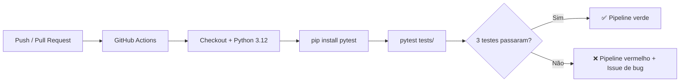

# 🧩 Atividade PBL – Aula 17
## Integração Contínua, Qualidade Automatizada, Métricas e Gestão de Defeitos – LocalEats

> Disciplina: Qualidade de Software  
> Prof.: Luciano Zanuz  
> Integrante: Filipe Tenedini Domingos  
> Sistema: [LocalEats](https://local-eats-unisenac.vercel.app/)

---

## 👥 Integrantes

- Filipe Tenedini Domingos

---

## 🔹 1. Repositório da Atividade

| Item | Descrição |
|---|---|
| **Nome do repositório** | `senac-localeats` (laboratório CI em `aula-17/localeats-ci-laboratorio/`) |
| **Link do repositório** | https://github.com/FilipeTenedini/senac-localeats |

### Estrutura de diretórios

```text
senac-localeats/
├── aula-17/
│   ├── localeats-ci-laboratorio/
│   │   ├── src/
│   │   │   ├── __init__.py
│   │   │   └── pedido.py
│   │   ├── tests/
│   │   │   └── test_pedido.py
│   │   ├── requirements.txt
│   │   └── pytest.ini
│   ├── issues/
│   │   ├── issue-01-feature-calculo-pedido.md
│   │   └── issue-02-bug-calculo-total.md
│   ├── evidencias/
│   │   └── pipeline-local.log
│   └── aula-17-integracao-continua-qualidade.md
├── .github/
│   ├── workflows/
│   │   └── quality.yml
│   └── ISSUE_TEMPLATE/
│       ├── feature.yml
│       └── bug.yml
├── aula-09/          # TDD — origem da regra de negócio
├── aula-10/          # E2E Playwright — login
└── aula-12/          # BDD — filtro por categoria
```

---

## 🔹 2. Planejamento da Funcionalidade

| Item | Descrição |
|---|---|
| **Título da Issue** | [Feature] Implementar cálculo do total do pedido com valor mínimo |
| **Objetivo da funcionalidade** | Calcular automaticamente a soma dos itens do pedido e validar se o total atinge o valor mínimo exigido pelo restaurante, evitando pedidos inválidos no LocalEats |
| **Link da Issue** | https://github.com/FilipeTenedini/senac-localeats/issues/new?template=feature.yml |

> **Corpo da Issue:** ver `aula-17/issues/issue-01-feature-calculo-pedido.md`  
> Após publicar no GitHub, substituir o link acima pelo número real (ex.: `/issues/1`).

---

## 🔹 3. Teste Automatizado

| Item | Descrição |
|---|---|
| **Tipo de teste** | Unitário |
| **Objetivo do teste** | Validar o cálculo correto do total do pedido e a rejeição de pedidos abaixo do valor mínimo |
| **Link para o arquivo do teste** | [aula-17/localeats-ci-laboratorio/tests/test_pedido.py](https://github.com/FilipeTenedini/senac-localeats/blob/main/aula-17/localeats-ci-laboratorio/tests/test_pedido.py) |

### Código do teste

```python
import pytest

from src.pedido import ValorMinimoNaoAtingidoError, calcular_total_pedido


def test_deve_calcular_total_quando_valor_minimo_atingido():
    itens = [
        {"nome": "Prato Especial 1", "preco": 51.25},
        {"nome": "Prato Especial 2", "preco": 17.49},
    ]

    resultado = calcular_total_pedido(itens, valor_minimo=30)

    assert resultado == pytest.approx(68.74)


def test_deve_aceitar_pedido_quando_total_e_exatamente_o_valor_minimo():
    itens = [{"nome": "Prato Especial 2", "preco": 30}]

    resultado = calcular_total_pedido(itens, valor_minimo=30)

    assert resultado == 30


def test_deve_lancar_erro_quando_total_fica_abaixo_do_valor_minimo():
    itens = [{"nome": "Prato Especial 2", "preco": 17.49}]

    with pytest.raises(ValorMinimoNaoAtingidoError, match="Valor mínimo do pedido não atingido"):
        calcular_total_pedido(itens, valor_minimo=30)
```

---

## 🔹 4. Pipeline de Integração Contínua

| Item | Descrição |
|---|---|
| **Nome do workflow** | Quality Check |
| **Evento que dispara a execução** | `push` e `pull_request` na branch `main` |
| **Link para o arquivo do workflow** | [.github/workflows/quality.yml](https://github.com/FilipeTenedini/senac-localeats/blob/main/.github/workflows/quality.yml) |
| **Link de execução do workflow** | https://github.com/FilipeTenedini/senac-localeats/actions/workflows/quality.yml |

### Código do workflow

```yaml
name: Quality Check

on:
  push:
    branches: [main]
  pull_request:
    branches: [main]

jobs:
  unit-tests:
    name: Testes unitários — cálculo de pedido
    runs-on: ubuntu-latest

    defaults:
      run:
        working-directory: aula-17/localeats-ci-laboratorio

    steps:
      - name: Checkout do repositório
        uses: actions/checkout@v4

      - name: Configurar Python
        uses: actions/setup-python@v5
        with:
          python-version: "3.12"
          cache: pip
          cache-dependency-path: aula-17/localeats-ci-laboratorio/requirements.txt

      - name: Instalar dependências
        run: pip install -r requirements.txt

      - name: Executar testes unitários
        run: pytest tests/ -v --tb=short
```

### Fluxo CI/CD



---

## 🔹 5. Indicadores de Qualidade

Execução local (espelha o pipeline CI):

```bash
cd aula-17/localeats-ci-laboratorio
pip install -r requirements.txt
pytest tests/ -v
```

| Indicador | Valor |
|---|---|
| **Quantidade de testes executados** | 3 |
| **Quantidade de testes aprovados** | 3 |
| **Quantidade de testes com falha** | 0 |
| **Status final do pipeline** | ✅ Sucesso |

### Evidência

Arquivo: `aula-17/evidencias/pipeline-local.log`

```
tests/test_pedido.py::test_deve_calcular_total_quando_valor_minimo_atingido PASSED [ 33%]
tests/test_pedido.py::test_deve_aceitar_pedido_quando_total_e_exatamente_o_valor_minimo PASSED [ 66%]
tests/test_pedido.py::test_deve_lancar_erro_quando_total_fica_abaixo_do_valor_minimo PASSED [100%]

3 passed in 0.02s
```

---

## 🔹 6. Registro de Defeito

| Item | Descrição |
|---|---|
| **Título do defeito** | [Bug] Cálculo do total retorna quantidade de itens em vez da soma dos preços |
| **Severidade** | Alta |
| **Link da Issue** | https://github.com/FilipeTenedini/senac-localeats/issues/new?template=bug.yml |

> **Corpo da Issue:** ver `aula-17/issues/issue-02-bug-calculo-total.md`

### Descrição do defeito (máx. 5 linhas)

O defeito foi **simulado** alterando `calcular_total_itens` para retornar `len(itens)` em vez da soma dos preços. O teste `test_deve_calcular_total_quando_valor_minimo_atingido` falhou imediatamente ao executar `pytest`, identificando que R$ 68,74 era esperado mas `2` era retornado. A falha também seria capturada pelo pipeline GitHub Actions em qualquer push. A correção restaurou `sum(item["preco"] for item in itens)` e os 3 testes voltaram a passar.

---

## 📊 Integração com entregas anteriores

| Aula | Contribuição para o fluxo CI |
|---|---|
| Aula 9 (TDD) | Regra de negócio e testes unitários base |
| Aula 10 (E2E) | Automação Playwright — candidata a job separado no CI |
| Aula 12 (BDD) | Cenários Gherkin — candidata a segundo job no pipeline |
| Aula 16 (DoD) | Critério "pipeline CI/CD verde" como gate de entrega |
| **Aula 17** | **Pipeline implementado com GitHub Actions + Issues** |

---

## 🚀 Como publicar e ativar o CI

```bash
git add aula-17/ .github/
git commit -m "feat: laboratório CI Aula 17 — testes unitários e GitHub Actions"
git push origin main
```

Após o push:
1. Acesse **Actions** no GitHub e verifique o workflow **Quality Check**
2. Crie as Issues usando os templates em `.github/ISSUE_TEMPLATE/`
3. (Opcional) Configure um **GitHub Project** vinculando Issues e PRs

---

## 💡 Conclusão

Esta atividade consolidou o fluxo de qualidade automatizado proposto nas Aulas 15 e 16: **Issues** para planejar e registrar defeitos, **testes unitários** como rede de segurança, **GitHub Actions** para integração contínua e **métricas** (3/3 passando) para acompanhar a saúde do código. O pipeline garante que alterações na regra de cálculo de pedidos sejam validadas automaticamente a cada push — reduzindo o risco de defeitos como os identificados manualmente na Aula 6 (44% de falha) chegarem à produção sem detecção.
